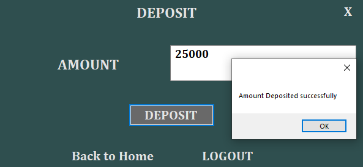
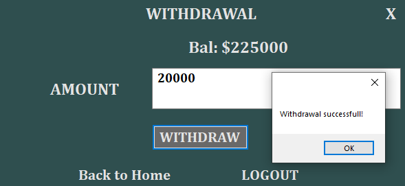

# ATM_Management_System
A Mock ATM System that uses Microsoft SQL Server as the database.

The StartUp Page

The Login Page

The Forgot Pin( email confirmation) page

The Forgot Pin( resetting pin) page

The Registration Page

The Home Page

The Deposit Page

The Withdrawal Page

The Fast Cash Page

The Balance Page

The Change Pin Page

The User Database Table

The User Transaction Table

The Statement of Transactions Page

